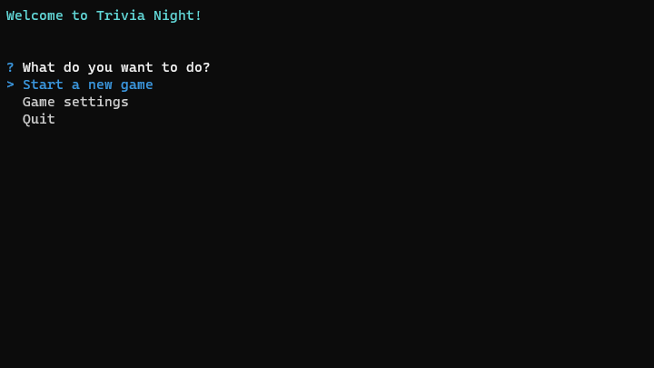

# Trivia Night


Simple trivia application written in C++, using [Open Trivia Database](https://opentdb.com/) Free API to query questions.

## Table of Contents
- [Features](#features)
- [Running the application](#running-the-application)
- [Screenshots](#screenshots)
- [Libraries Used](#libraries-used)
- [Building from scratch](#building-from-scratch)
- [License](#license)
- [Acknowledgements](#acknowledgements)

## Features
- Cross-platform support (Windows and Linux)
- Adjustable game settings
- Interactive, colorful CLI interface
- End-of-game statistics
- Over 5000 different questions

[\[ back to top \]](#table-of-contents)

## Running the application
It's really simple - all you have to do is to download a [prebuilt binary](../../releases/latest) (or [build your own](#building-from-scratch) if you're brave enough), then execute the program.

Use the `arrow keys` to move around, and `Enter` to Confirm.

[\[ back to top \]](#table-of-contents)

## Screenshots



[\[ back to top \]](#table-of-contents)

## Libraries Used
- [**curl**](https://curl.se/): command line tool and library for transferring data with URLs
- [**nlohmann/json**](https://github.com/nlohmann/json): JSON for Modern C++
- [**aelliixx/cpp-inquirer**](https://github.com/aelliixx/cpp-inquirer): Interactive command line prompts with C++ (modified by me)
- [**lamarrr/chalk**](https://github.com/lamarrr/chalk): C++ terminal styling done right (modified by me)

[\[ back to top \]](#table-of-contents)

## Building from scratch
1. Clone the repository
```
$ git clone https://github.com/Spookyless/trivia-night.git
```

2. Install the dependencies and properly link them by modifying [CMakeLists.txt](./CMakeLists.txt)

3. Navigate to the project root and build the app
```
$ cd trivia-night
$ cmake .
$ make
```

[\[ back to top \]](#table-of-contents)

## License

This project is licensed using [MIT](./LICENSE) license.

[\[ back to top \]](#table-of-contents)

## Acknowledgements

- [Open Trivia Database](https://opentdb.com/) for providing a **Free API** with many customization options and large database of questions!

[\[ back to top \]](#table-of-contents)